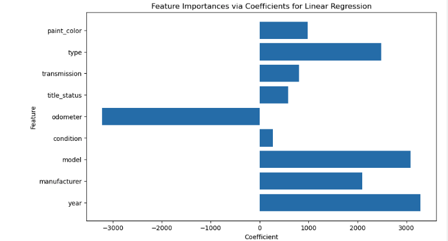

# What drives the price of a car?

We used the used car dataset to understand the most important features that impact
the price of the car.

We found Age, Odometer reading, Make/Model/Type of the car as the top-5 features.

## Summary

The factors that most influence the price of a used car are: year (age), odometer (reading),
manufacturer, model and type. Maintaining a good inventory of newer cars with low odometer
reading with a special focus on certain make/model/type of the vehicle will provide a
competitive edge. When adding a car to the fleet run it through the model to determine the
price at which the car would sell to ensure profitability.